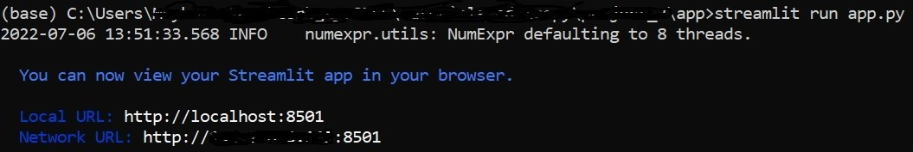

# Locally hosted web application using [Streamlit](https://streamlit.io/)

This folder contains code and associated files that can be used to host the web application locally on default domain `localhost:8501`.

Using Anaconda prompt, `$ pip install streamlit`. For more details, go to [Streamlit](https://docs.streamlit.io/library/get-started/installation).

Then navigate to folder in computer that contains the `app.py` file, enter command > `streamlit run app.py`. 

You should see the following:

A new tab/window will open on your default web browser. That new tab/window is the web application. 

Enjoy!

[My Reference](https://www.analyticsvidhya.com/blog/2021/07/streamlit-quickly-turn-your-ml-models-into-web-apps/)
