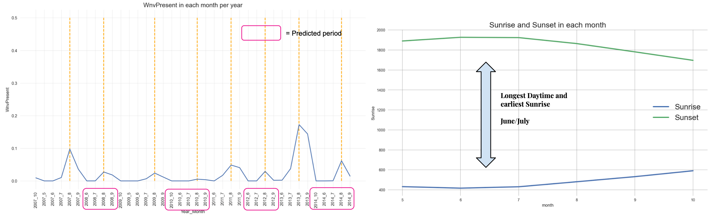

#  Project 4: West Nile Virus Prediction

## Problem Statement

We are a group of consultants for the City of Chicago and Chicago Department of Public Health (CDPH). Our task is to:

- predict when and where different species of mosquitoes will test positive for West Nile Virus; and
- Investigate if the effect of spray could be optimized.

## Background

In 2002, the first human case of West Nile Virus were reported in Chicago. By 2004 the City of Chicago and CDPH had established a comprehensive surveillance and control program that is still in effect today.

20% who are infected with the virus develop symptoms ranging from a persistent fever, to serious neurological illnesses that can result in death.

Every week from late spring through the fall, mosquitos in traps across the city are tested for the virus. The results of these tests influence when and where the city will spray airborne pesticides to control adult mosquito populations.

A more accurate method of predicting outbreaks of West Nile virus in mosquitoes will aid the City of Chicago and CDPH more efficiently and effectively allocate resources towards the prevention of the virus.

## Datasets

* `train.csv`, `test.csv`: the training and test set of the main dataset. The training set consists of data from 2007, 2009, 2011, and 2013, while in the test set we are requested to predict the test results for 2008, 2010, 2012, and 2014.

|Features              |  Description       |                                            
|:---------------------|:-------------------|
|Id                    |  the id of the record                                                  |
|Date                  | date that the WNV test is performed                                    |
|Address               | approximate address of the location of trap.   This is used to send to the GeoCoder|
|Species               | the species of mosquitos                                               |
|Block                 | block number of address                                                |
|Street                | street name                                                            |
|Trap                  | Id of the trap                                                         |
|AddressNumberAndStreet| approximate address returned from GeoCoder                             |
|Latitude, Longitude   | Latitude and Longitude returned from GeoCoder                          |
|AddressAccuracy       | accuracy returned from GeoCoder                                        |
|NumMosquitos          | number of mosquitoes caught in this trap                               |
|WnvPresent            | whether West Nile Virus was present in these mosquitos.   1 means WNV is present, and 0 means not present. |

* `spray.csv`: GIS data of spraying efforts in 2011 and 2013

|Features            |  Description                           |
|:-------------------|:---------------------------------------|
|Date, Time          | the date and time of the spray         |
|Latitude, Longitude | the Latitude and Longitude of the spray|

* `weather.csv`: weather data from 2007 to 2014. Column descriptions in `noaa_weather_qclcd_documentation.pdf`.

* `sampleSubmission.csv`: a sample submission file in the correct format

## Modelling Process
The follow steps were taken:

1. [Data Cleaning / Preprocessing / Feature Engineering](## Data Cleaning / Preprocessing / Feature Engineering)
2. [Exploratory Data Analysis](## Exploratory Data Analysis)
3. [Hyperparameter Tuning / Modelling](## Hyperparameter Tuning / Modelling)
4. [Results](## Results)
5. [Conclusions and Recommendations](## Conclusions and Recommendations)

## Data Cleaning / Preprocessing / Feature Engineering

The following steps was performed on all datasets:

* check for null and missing values; and
* set dates as index, and sorted by their dates

#### Training/Test Dataset
* CountVectorise `species` feature
* include `unspecified` for training dataset
*  Split `train.csv` and `test.csv` based on weather stations

#### Weather Dataset
* Replace 1609 missing values in `CodeSum` feature with np.nan, then fillna(‘M’) for count vectorization
* Used `count vectorization` to separate combinations, and account for individual codes within combinations
* Duplicate sunrise, sunset values from station 1 to station 2
* Split `weather.csv` into station 1 and station 2

#### Spray Dataset
* Created new feature `spray` using spray dates and locations.
* For test set, `spray` feature was assigned zero values to signify no spray (no spray data for test set dates)

All the datasets were then merged together using train/test date index since train/test date range is narrower.

### Feature Engineering
* Separate dates into new `day`, `month`, `year` features
* Add new dates features to both train and test sets to make sure features match
* `test.csv` has traps not found in `train.csv`. Added traps to train data, to match test data.
* SMOTE the training data to account for data imbalance

## Exploratory Data Analysis

##### Weather Data

##### Number of Mosquitoes by Date

##### Number of mosquitoes per species

##### Presence of WNV Virus

##### Correlation Heatmap of merged Training Data

## Hyperparameter Tuning / Modelling

Five types of classifiers were used in this project, followed by stacking of the top 3 models. Through GridSearch, the models were tuned with certain hyperparameters.

1. Random Forest
2. Gradient Boosting
3. XGBoost
4. LGBM
5. Neural Network
6. Stacking (XG Boost, LGBM, Gradient Boost)

|Model|Hyperparameters|Test Accuracy|
|---------|----------|--------------|
|XGboost|Learning_rate = 0.2, Objective=binary:logistic, Max_depth = 4 , N_estimators =  300, tree_method = hist|0.929|
|LGBM|objective = binary, N_estimators = 500, learning_rate = 0.01, num_leaves = 50, max_depth = 35, reg_alpha = 0.3|0.914|
|Gradient Boost|n_estimators = 400, max_depth = 10, min_samples_split = 2, max_features = log2, learning_rate = 0.15|0.931|
|Random Forest|n_estimators = 1600, max_depth = 10, min_samples_split = 10, min_samples_leaf = 5|0.788|
|Neural Network|Input layer = 100 neurons, activation ‘relu’, hidden layer = 1 (100 neurons, activation ‘relu’), Output activation ‘sigmoid’, Optimizer : Adam, Loss: binary_crossentropy|0.873|
|Stacking|K-folds = 2, Meta Model = Logistic Regression|0.933|

We have determined that the accuracy in prediciting the 'True Positive' is the most important factor and would prefer a high recall and F1 score for positive class. Hence, the we altered the threshold to increase the recall and F1 score.

|Metrics|Treshold = 0.5|Treshold = 0.1|Changes|
|---------|----------|-------|---------|
|Accuracy|0.93|0.89|-4.3%|
|F1 Score|0.28|0.3|7%|
|Recall|0.26|0.46|77%|

## Results

### Feature Importance

Based on our findings, we determined that the 3 most important features for the analysis are:

1. ##### Cycle of time (month)
	- Temperature
	- Sunrise/Sunset
	- Standard Pressure

2. ##### Location
	- Latitude
	- Longitude

3. ##### Species
	- Culex Restuans
	- Culex Pipiens

### Spraying Period

The sprays were conducted in August 2013 (during the peak month) but they were found to be ineffective. Mosquitoes tend to be most active in the early morning and this also means that mosquitoes tend to feed on birds, which is the main source of transmission.

To optimise the spraying time, we can alter the spraying period from August to June / July instead as these months have longer days and earlier sunrise.

### Spray Location

In order to optimise the spraying location, we can target locations present with high clusters of West Nile Virus. The top 10% of the clustered locations are found to have four times more chances of positive detection that randomly selecting traps locations.

This means that there is also a cost savings of about 75% (assuming spraying is effective).

## Conclusions and Recommendations

The spike of the number of mosquito does not match with any event of spray, we also cannot observe any significant improvement on the weeks after spraying. Besides that, our team will need more data for more detail analysis in the future especially the actual data for the next 12 months after spraying. Hence, we concluded that the effect of spray in 2011 and 2013 are inconculsive.

The number of mosquitos per year in the dataset is not constant, as there are more traps placed in 2007 and 2013 than 2009 and 2011. This would give an impression that there are more mosqutios caught in those years. The spraying is also not done at the same location and time, which would not be able to give a more comparsion between the years of whether spraying is effective or not.

In future, we encourage the data collection team to collect more data so that we can generate more insights on the result of spraying. E.g.: at least 12-24 months of data after the spray. It will also be good to understand the reason to why less traps were placed in 2009 and 2011, as this would give a better understanding of the number of mosquitos in those years. As the number of mosquitos is affected by the number of traps placed.

However, we are able to provide ideas to target the West Niles Virus base on the trends and data science analysis from our model.

##### Spraying Period
- The weather does affect the number of mosquitos, as the number of mosquitos is mainly affected by the temperatures, humidity and the amount of day time.
- By looking at the period of coverage of the spray, it was pretty accurate on the peak period of WNV (July to September).But it is still less effective agaisnt the West Nile Virus.
- As from the historical data, the everage sunrise time in June and July are the earliest and the daytime are the longest.
- Our team's hypothesis would be:
	1. The mosquito mostly feed on bird during that period due to less human active in earlier daylight
	2. The peak of transmission of virus within the mosquito happen during June to July
	3. While the data shows the mosquito are usually active in the morning (Sunrise)
	4. Hence, our team suggest to shift the spray period to June - August

##### Spray Location
- According to our lift curve in section (4.2 Model Evaluation), we have 4 times effective spray at the top 10% location than randomly spray.
- By targetting on the top 10% location,, the cost can reduced to 0.25X.
- This will result in cost optimisation about 75%.

The insecticide can be genetically engineered to target the particular species that have the highest possibility of present the virus. The species is: Culex Restuans/Pipiens. In fact West Nile virus (WNV) is a mosquito-borne virus that is mainly transmitted among birds by Culex pipiens mosquitoes. The cost saved from spraying on the more critical location can be used in R&D to develope a more effective insecticide

Lastly, the base boosting models: Gradient Boost and Adaboost could be the best fit for this data science problem. Stacking of models is not worth the engineering resources due to time taken and the insignificant improvement.
